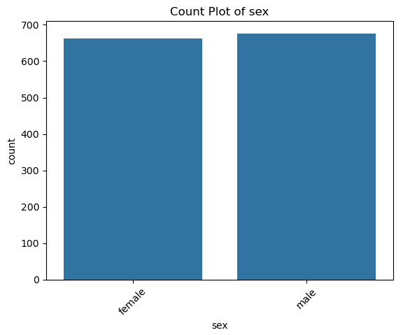
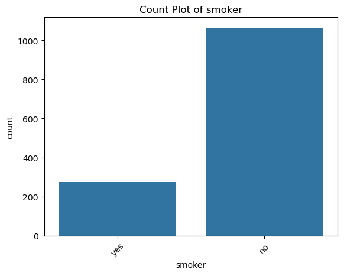
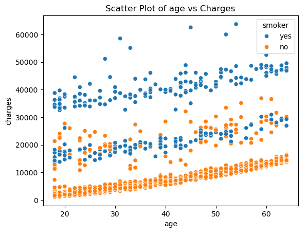
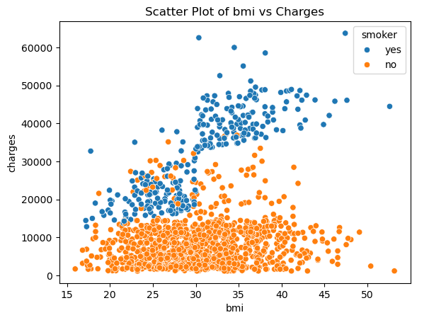
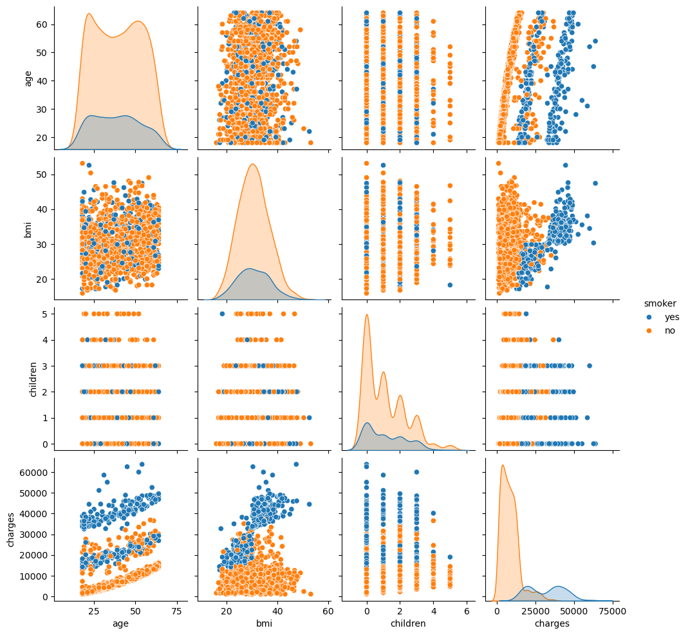

# 📊 Insurance Cost Analysis

## 📌 Overview
This project analyzes medical insurance data to identify key factors influencing insurance charges. The goal is to uncover patterns that can support data-driven pricing strategies and risk assessment.

---

## 🎯 Objective
To perform exploratory data analysis (EDA) on insurance data and determine how demographic and lifestyle factors impact medical insurance premiums.

---

## 📂 Dataset
The dataset contains 1,338 records with the following features:
- Age
- Gender
- Body Mass Index (BMI)
- Number of children
- Smoking status
- Region
- Medical insurance charges

Source: Public insurance dataset (Kaggle)

---

## 🛠 Tools & Technologies
- Python (Pandas, NumPy)
- Data Visualization (Matplotlib, Seaborn)
- Jupyter Notebook

---

## 🔍 Analysis Process
- Data loading and inspection
- Data cleaning and validation
- Exploratory data analysis (EDA)
- Visualization of relationships between variables

---

## 📊 Key Insights
- Smoking is the strongest predictor of insurance costs, with smokers incurring significantly higher charges  
- Insurance charges increase consistently with age  
- Higher BMI is associated with increased medical costs  
- Individuals who smoke and have high BMI represent the highest-risk group  
- Region and number of children have minimal impact on charges  

---

## 💡 Business Recommendations
- Implement risk-based pricing strategies considering smoking status  
- Promote preventive healthcare programs to reduce long-term costs  
- Use age and BMI segmentation for more accurate premium calculation  
- Leverage insights for predictive modeling of insurance costs  

---

## 📊 Visual Insights

### Sex Distribution

### Smoking Impact

### Age vs Charges

### BMI vs Charges

### Pairplot Analysis

---

## 🧠 Conclusion
The analysis highlights smoking, age, and BMI as key drivers of medical insurance costs. These insights provide a strong foundation for improving pricing strategies and developing predictive models.

---

